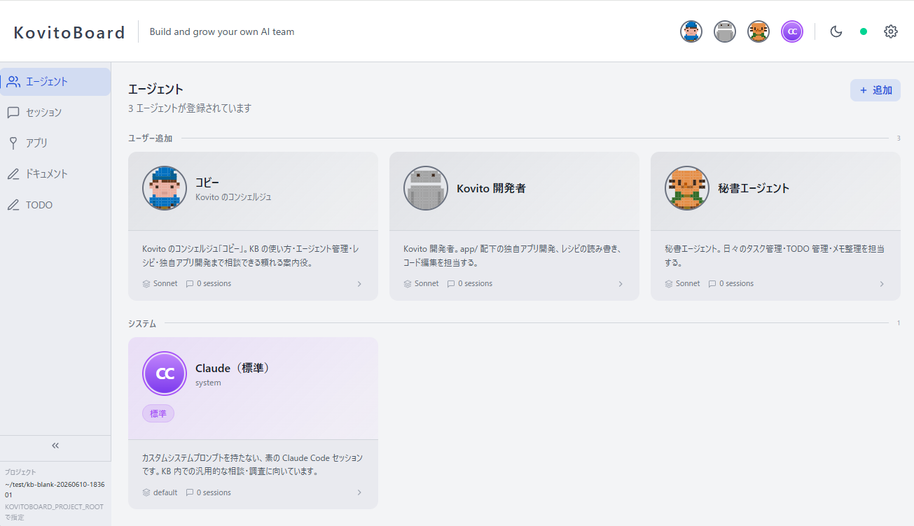
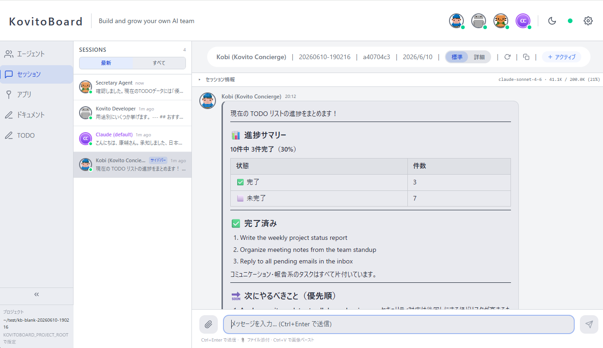
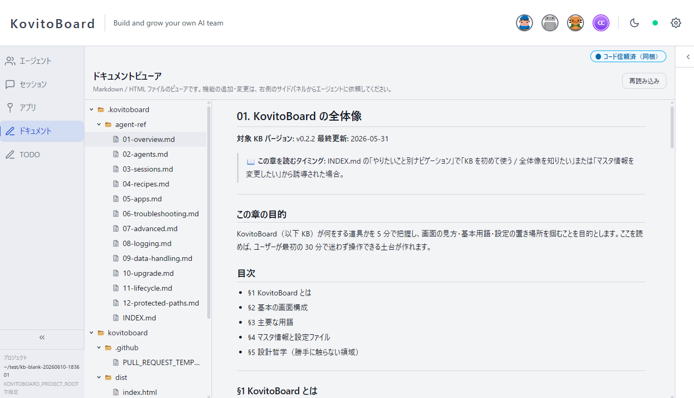
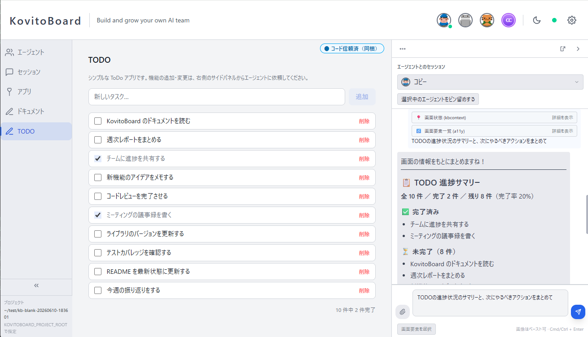

[English](README.md) | [日本語](README.ja.md)

<div align="center">

# KovitoBoard

### ブラウザ上で、自分専用の AI チームを作って育てる。

[](./LICENSE)
[](https://docs.anthropic.com/en/docs/claude-code)
[](#動作要件)
[](https://github.com/kovito-dev/kovitoboard)

**🌐 [kovito.ai](https://kovito.ai)** · [クイックスタート](#クイックスタート) · [なぜ KovitoBoard か](#なぜ-kovitoboard-か) · [ライセンス](#ライセンス)

</div>

---

KovitoBoard は、お使いの Claude Code 上でローカルに動くオープンソースの WebUI です。

たとえば調べ物・執筆・開発と画面を分け、それぞれに専属のエージェントを置く。画面を見ながら
相談し、必要なら割り込む——**進めるペースはあなたが決められます。** 基本操作にターミナルは
要りません。

インストールされたプロジェクトの Claude Code の定義を読み取り、エージェント管理・ライブ
セッションでのやり取り・アプリの開発と実行を、すべてブラウザだけで行えます。

## 動く様子

|  |  |
|---|---|
|  |  |
| **自分のチームを見渡す** — 個性と役割をもつエージェントを一覧できます。 | **ブラウザでエージェントと話す** — 画像やファイルの添付にも対応。 |
|  |  |
| **自分だけのアプリを作る** — 依頼するだけで、自分の仕事に合わせたアプリを。 | **アプリを見ながら一緒に進める** — 画面を見ながら作業を。 |

> すべての紹介は **[kovito.ai](https://kovito.ai)** をご覧ください。

## KovitoBoard の特徴

完成品を“使う”SaaS ではなく、**自分の道具として“育てる”。** だから、自分の仕事のやり方に
合わせて作り変えていけます。

- 🧑‍🤝‍🧑 **顔と役割をもつエージェント**が画面に並び、チームとして見渡せる。
- 🎛️ **自律で動くエージェント**を、承認や割り込みで指揮できる——あなたが指揮者です。
- 🌱 **作ったチームも画面も自分の資産として残り**、ずっと育てられる。

## なぜ KovitoBoard か

Claude を使っているのに、単発の作業で止まっていませんか？ Claude のエージェントは、役割を
もったチームとして動かすほど力を発揮します。KovitoBoard は、そのチームをあなたの手でつくり、
指揮し、育てるための土台です。

| | Claude Code 単体 | KovitoBoard あり |
|---|---|---|
| **チームが見える** | エージェントの個性や顔が見えない | 個性と役割を持つエージェントが画面に並ぶ。誰に何を任せているか見える |
| **あなたが率いる** | 決まった作業を AI に任せきり。やり方も結果も AI 次第 | 自分の判断やこだわりを反映しながら、チームと一緒に進める |
| **残って育つ** | その場の生成物で終わり、チャットの中で流れてしまう | やり取りも作ったチームもアプリも自分のシステムとして残り、日々育つ |

Claude Code / Claude Desktop を置き換えるものではありません。その**次の一歩**として一緒に
使います。

## 機能

### エージェントダッシュボード
エージェント定義の閲覧と確認。詳細・メタデータ・元の Markdown 定義を表示できます。テンプレート
からの作成・スクラッチからの作成に加え、構造化フィールド（人格・口調・追加指示）をブラウザから
直接編集できます。

### ライブセッション
稼働中の Claude Code セッションと、ブラウザから直接やり取りできます。メッセージの送信、画像や
ファイルの共有、セッションの再開・継続が可能です。更新はリアルタイムで反映され（JSONL セッション
ファイルを chokidar で監視し、WebSocket 経由でブラウザへプッシュ）、会話を追うだけでなく、あなた
自身が会話を動かせます。

### アプリ拡張
カスタムページ・API ルート・スタイルを `app/` ディレクトリに配置することで、コアソースを書き
換えずに KovitoBoard を拡張できます。動作する例として `app.example/` を参照してください。

### レシピシステム
エージェントレシピ — エージェント定義・ページコンポーネント・API 拡張をパッケージ化した可搬
バンドル — のインポート・確認・エクスポート。（新規レシピのインストールは v0.3.0 で KovitoHub
とともに再有効化されます。[レシピ配布モデル](#レシピ配布モデル)を参照。）

### Trust Prompt 中継
Claude Code が tmux セッションで trust prompt(例:「このファイルを作成しますか?」)を表示した
際、KovitoBoard は `capture-pane` ポーリングで検知し、ブラウザ UI に中継します。承認・拒否は
ダッシュボードから直接行えます。

## 動作要件

- [Claude Code](https://docs.anthropic.com/en/docs/claude-code)(`@stable` チャンネル推奨 — [サポートする Claude Code バージョン](#サポートする-claude-code-バージョン)参照)
- Node.js 20 以降
- tmux 3.4 以降
- npm 9 以降
- モダンな Web ブラウザ

> **OS:** macOS / Ubuntu・Debian / WSL2。Windows はネイティブ単体では非対応です。WSL2 経由でご利用ください。

> ソフトウェア自体は無料(AGPL v3)です。エージェントとの対話には Claude Code を使うため、
> **Claude Code のサブスクリプション**が別途必要です。KovitoBoard を導入したことで追加の費用
> が必要になることはありません。

### tmux のインストール

`tmux` は npm パッケージではなく OS レベルのプログラムで、KovitoBoard が Claude Code を駆動する
ために利用します。macOS は古いバージョンが入っているため、Homebrew でインストールまたは更新して
ください。

```bash
# macOS (Homebrew)
brew install tmux
# 既にインストール済の場合:
brew upgrade tmux

# Ubuntu / Debian / WSL2
sudo apt-get install tmux
```

バージョンを確認:

```bash
tmux -V   # → tmux 3.4 以上
```

## クイックスタート

始め方は 2 通りです。普段 Claude Desktop しか触っていないなら **経路 A**、ターミナルに慣れて
いるなら **経路 B** を選んでください。

### 経路 A: Claude Desktop（ターミナル不要）

Claude Desktop のコード実行機能に、リポジトリ URL を含む短いプロンプトを送るだけ。clone・
インストール・起動までを Claude が進め、ブラウザで KovitoBoard が開きます。

```text
GitHub の https://github.com/kovito-dev/kovitoboard を clone して、KovitoBoard を
セットアップ・起動してください。npm install まで済ませたら、このプロジェクトを対象に
起動して、ブラウザで開くアドレスを教えてください。
```

必要なのは **Claude Code のサブスクリプション**だけ。追加料金はかかりません。

### 経路 B: CLI

ターミナルで直接 clone して起動します。

```bash
# 1) 自分の Claude Code プロジェクトディレクトリ内で KovitoBoard を clone
cd /path/to/your-claude-code-project
git clone https://github.com/kovito-dev/kovitoboard.git
cd kovitoboard
npm install

# 2) 起動 — `app/` 配下の拡張に対するホットリロードが有効な状態で立ち上がります
npm start -- --project-root ..

# 3) `npm start` の出力末尾に表示される URL をブラウザで開きます。
#    既定では http://localhost:5173 ですが、5173(またはバックエンドの 3001)が
#    使用中の場合、supervisor が次に空いているポートに自動フォールバックします。
#    必ず supervisor が出力する
#    "Frontend: http://localhost:<port>  ← open this in your browser"
#    の行を確認してください。
```

#### 新規ディレクトリで始める場合

まだ Claude Code プロジェクトを持っていない場合でも、新しく作った空のディレクトリに KovitoBoard
を導入して始められます。エージェント一覧は空の状態でスタートし、`.claude/agents/*.md` を追加し
ながらチームを育てていけます。

```bash
mkdir my-workspace
cd my-workspace
git clone https://github.com/kovito-dev/kovitoboard.git
cd kovitoboard
npm install
npm start -- --project-root ..
```

> **Note:** KovitoBoard は既定で開発モードで起動します。これにより、プロジェクト直下の `app/`
> ディレクトリに配置されたユーザー拡張(レシピ apply 経由など)のホットリロードが有効になります。
> 同ディレクトリのファイルを変更してもサーバーの再ビルド・再起動は不要です。
>
> **Tip:** KovitoBoard をネストした git リポジトリとして追跡しないために、プロジェクトの
> `.gitignore` に `kovitoboard/` を追加することをおすすめします。

> **Note:** KovitoBoard 自体は Claude Code プロジェクト**ではありません**。既存の Claude Code
> プロジェクトの `.claude/agents/` ディレクトリと JSONL セッションファイルを読み取る、通常の
> プログラムです。

### KovitoBoard を再び起動する（翌日・停止後・PC 再起動後）

clone と `npm install` は **最初の 1 回だけ** です。オンボーディング後は KovitoBoard がプロジェ
クトのパスを `.kovitoboard/setting.json` に記憶するため、翌朝・停止後・PC の再起動後にもう一度
立ち上げたいときは、同じディレクトリから再度起動するだけです。

```bash
cd /path/to/kovitoboard   # clone したディレクトリ
npm start                 # オンボーディング後は --project-root を省略できます
```

出力に表示される `Frontend: http://localhost:<port>` の行をブラウザで開きます。

**Claude Desktop（経路 A）を使う場合:** clone し直すのではなく、既存の clone を指す短いプロンプト
を送ります。

```text
/path/to/kovitoboard にある既存の clone から KovitoBoard を起動して、ブラウザで開く
アドレスを教えてください。
```

**停止するには:** 起動しているターミナルで `Ctrl+C` を押すか、KovitoBoard ディレクトリで
`npm run kb:stop` を実行します（バックグラウンドで起動した場合は `kb:stop` を使います）。

### PC 起動時に自動で立ち上げる（任意）

PC を起動するたびに KovitoBoard を自動で立ち上げたい場合は、バックグラウンドで起動し、その
コマンドをログイン時に OS から実行させます。まずバックグラウンド起動が動作することを確認します。

```bash
cd /path/to/kovitoboard
npm run start:detach   # バックグラウンドで起動し、supervisor の PID を表示します
```

ログは `.kovitoboard/logs/current.log` に出力され続け、`npm run kb:stop` でいつでも停止できます。
次に、このコマンドを OS に登録します。

- **macOS:** *ログイン項目*（システム設定 → 一般 → ログイン項目）に追加するか、KovitoBoard
  ディレクトリで `npm run start:detach` を実行する `launchd` ユーザーエージェントを作成します。
- **Linux / WSL2:** `~/.config/systemd/user/` に `npm run start:detach` を実行する systemd
  **ユーザー** サービスを作成し、`systemctl --user enable --now kovitoboard` で有効化します。
  WSL2 では先に `/etc/wsl.conf` で systemd を有効化するか、シェルのプロファイルにコマンドを
  追記してください。

> KovitoBoard は起動元の `PATH` に `tmux` と `claude` が必要なため、システム全体のサービスより
> ログインスコープの仕組み（ログイン項目 / systemd **ユーザー** サービス）を推奨します。

### `--project-root` に指定できる対象

`--project-root` には以下のいずれかを指定できます。

1. **既存の Claude Code プロジェクト**(`.claude/agents/` あり) — 全機能が使用可能
2. **真新しい空ディレクトリ** — エージェント一覧は空の状態で始まります。`.claude/agents/*.md` を配置してチームを育てていけます
3. **以前 Claude Code プロジェクトとして使われていたディレクトリ** — 過去のセッションログが見えます。Claude Code はセッションログを絶対パスで保存するため、同じディレクトリを再利用すると過去履歴が再表示されます

### 起動方法のバリエーション

- **別プロジェクトを対象にする:** `npm start -- --project-root /absolute/path`
- **環境変数で指定:** `KOVITOBOARD_PROJECT_ROOT=/path npm start`
- **コントリビューター / 本番モード(静的ビルド):** [CONTRIBUTING.md](./CONTRIBUTING.md) を参照。エンドユーザーには不要です
- **永続設定:** オンボーディング完了後、`.kovitoboard/setting.json` がプロジェクトパスを記憶します。同じディレクトリから起動する場合は次回以降 `--project-root` を省略できます
- **バックグラウンド起動(detach):** `npm run start:detach`、`npm start -- --detach`、または `KOVITOBOARD_DETACH=1 npm start` で supervisor をバックグラウンドに再実行し、シェルに即座に制御が戻ります。supervisor の PID が表示されるので、停止は `kill <pid>` で行ってください。ログは引き続き `.kovitoboard/logs/` に書き出されます(動作確認は `current.log` を tail してください)。フラグなしの起動は従来どおり foreground のままです
- **ポート:** Vite dev server は既定で **5173**、バックエンド API は既定で **3001** です。supervisor(`tools/kb-start.mjs`)が起動時に両ポートをプローブし、使用中なら次に空いているポート(`5174`, `5175`, …/ `3002`, `3003`, …)にフォールバックします。必ず `[kb-start] Frontend: http://localhost:<port>` の行に出ている URL を開いてください。

  特定のポートに固定したい場合(使用中ならフォールバックせず即エラーで終わらせる場合):

  ```bash
  # CLI フラグ
  npm start -- --port=8080 --vite-port=8000

  # 環境変数(従来形式、CLI 解析後の優先順は CLI フラグと同等)
  PORT=8080 VITE_PORT=8000 npm start
  ```

  CLI フラグは環境変数より優先され、両者ともオートプローブを上書きします。

優先順(高い順):
`--project-root` → `KOVITOBOARD_PROJECT_ROOT` → `.kovitoboard/setting.json` → `process.cwd()`

起動時には解決されたプロジェクトルートとその出処がサーバーログに出力されるため、想定通りに解決
されているか確認できます。

```
[kovitoboard] Project root: /path/to/project (source: cli-arg)
```

## ログとトラブルシューティング

KovitoBoard は構造化ログを `.kovitoboard/logs/` 配下に JSON Lines 形式で書き出します。日次
ローテーションを行い、既定では 7 日間保持します。最新のログには `current.log` シンボリック
リンクからアクセスできます。

```
.kovitoboard/logs/current.log              -> latest rotated file
.kovitoboard/logs/server.YYYY-MM-DD.<n>.log
```

保持期間やログレベルは環境変数または `.kovitoboard/setting.json` から上書きできます。

```bash
KOVITOBOARD_DEBUG=1                  # debug レベルのログ出力
KOVITOBOARD_LOG_RETENTION_DAYS=14    # 1〜365 日(環境変数が setting.json より優先)
```

```jsonc
// .kovitoboard/setting.json
{
  "logging": { "retentionDays": 14 }
}
```

不具合報告時には診断レポートを生成してください。

```bash
npm run diagnose > diag.md
```

`diag.md` には KovitoBoard / Node / OS / Claude Code / tmux のバージョン、`setting.json` の
オンボーディング状態、稼働中のサーバーログ末尾 100 行が含まれます。ホームディレクトリのパスは
`~` にマスクされますが、GitHub Issue に貼り付ける前に内容(特にログ行)を確認してください。
マスクされない機微情報が残っている可能性があります。

より詳しい案内はエージェント用リファレンス [`docs/agent-ref/`](./docs/agent-ref/) を参照してください。

## レシピ配布モデル

KovitoBoard は **アプリケーション本体** (AGPL-3.0 ライセンスの OSS) と **レシピ配布** (安全性
のために設計された二段モデル) を区別します:

- **KovitoHub signed publisher (推奨、v0.3.0 から提供):**
  レシピは KovitoHub という中央マーケットプレイスを通じて配布されます。
  Publisher が登録され、レビューを受け、レシピに暗号署名します。
  一般 user および自分のレシピを他者に配布したい場合の推奨経路です。

- **Developer sideload mode (opt-in、v0.3.0 から提供):**
  ローカルテスト / 開発用途では、KovitoBoard 起動前に
  `KB_DEVELOPER_MODE=1` を設定することで sideload モードを有効化できます。
  Sideload されたレシピは厳格な warning を表示し、他 user への再配布は不可です。

### 現状 (v0.2.x)

`/api/recipes/install` 経由のレシピインストールは v0.2.x で **一時的に無効化** されています。
インストールフローは **v0.3.0** で KovitoHub 統合とともに再有効化されます。

- **既存レシピ** (v0.1.x または install disable 適用前の v0.2.0 でインストール済) は変更なく動作し続けます (grandfather、`docs/specs/recipe-system.md` で grandfather 契約を参照)。表示・アンインストール・エクスポートのフローは維持されます。
- **同梱サンプルレシピ** は「アプリ」画面の Sample apps タブから直接有効化できます。
- **新規レシピのインストール** は v0.3.0 まで利用できません。

より詳細な背景 (OSS 哲学 + signed-only 配布 + developer sideload) は、
`docs/specs/prompt-injection-threat-model.md` (起票予定) を参照してください。

**注**: prompt-injection-threat-model spec を導入する KB バージョンの確定は v0.3.0 release plan で行います。

## データの取り扱い

KovitoBoard は Claude Code を介してエージェントを動かします。以下の点に注意してください。

- **KB 上に表示されている情報は、ユーザーがエージェントに尋ねた時点で Claude(モデル)に転送されます**。Ambient Session Sidebar 経由の画面コンテンツ、Document Viewer のようなアプリで開いたファイル、レシピ経由でロードされた情報も含まれます
- **Anthropic 側のデータ取扱い設定が適用されます。** Claude Pro/Max アカウントでは「自分のデータを学習に使わない」がデフォルトで有効になっています。Claude のアカウント設定から確認できます
- **機微なデータを扱うアプリケーションでは、データ取り込み層でのマスキングを強く推奨します**(例: ファイルロード時にシークレット値を redact する、画面に流す前に機微フィールドを隠す等)。KovitoBoard は組み込みのマスキング機構を提供しません。アプリ作者・レシピ作者がデータフローの設計時にこの点を意識することを推奨します

KovitoBoard 本体が、あなたのコードや会話の内容を外部へ送ることはありません。データはお使いの
マシン内に保存されます(バージョン確認のための匿名通信のみ行い、これも設定で無効化できます)。
詳細は [docs/agent-ref/09-data-handling.md](./docs/agent-ref/09-data-handling.md) を参照してください。

## サポートする Claude Code バージョン

KovitoBoard は Claude Code の **`@stable`** リリースチャンネルに追従します。trust prompt 検出
パターンは特定バージョンに対して校正されており、その近傍のリリースに対しては best-effort で
サポートを提供します。

| | バージョン |
|---|---|
| **主要動作確認(primary tested)** | 2.1.153(`@stable` チャンネル) |
| **Best-effort** | 2.1.x / 2.2.x |

### 推奨セットアップ

stable チャンネルをインストール(またはピン留め)します。

```bash
npm install -g @anthropic-ai/claude-code@stable
```

または Claude Code の組み込み自動更新を使用している場合は、Claude Code 設定(`~/.claude/settings.json`)でチャンネルを指定します。

```json
{
  "autoUpdatesChannel": "stable"
}
```

### 起動時のバージョンチェック

KovitoBoard は起動時に `claude --version` を実行し、結果を主要動作確認バージョンと照合します。
差異がある場合はサーバーログに警告が出力されます。KovitoBoard はそのまま起動しますが、trust
prompt 検出が想定外の挙動を示す可能性があります。

### トラブルシューティング

1. インストール済みのバージョンを確認: `claude --version`
2. stable チャンネルに切り替え: `npm install -g @anthropic-ai/claude-code@stable`
3. KovitoBoard を再起動(`npm start`)
4. それでも trust prompt 検出が失敗する場合は、`claude --version` の出力とサーバーログを添えて [Issue を起票](https://github.com/kovito-dev/kovitoboard/issues) してください

## エージェント定義

KovitoBoard は `<project-root>/.claude/agents/*.md` からエージェント定義を読み取ります。

各 `.md` ファイルは YAML frontmatter を使用します。

```markdown
---
name: my-agent
displayName: My Agent
description: A helpful agent
color: blue
---

# My Agent

System prompt and instructions go here.
```

### 必須フィールド

| フィールド | 説明 |
|-------|-------------|
| `name` | 一意識別子(kebab-case) |
| `displayName` | UI 上の表示名 |
| `description` | 短い説明 |

### 任意フィールド

| フィールド | 既定値 | 説明 |
|-------|---------|-------------|
| `color` | `gray` | エージェントカードのテーマ色 |
| `summary` | — | 一覧で表示される 1 行サマリ |

## アーキテクチャ

```
Browser (React + Vite)
   ↕ WebSocket + REST
Express Server
   ├── Agent Reader      (.claude/agents/*.md)
   ├── Session Manager   (JSONL file watcher via chokidar)
   ├── Trust Prompt Detector (tmux capture-pane polling)
   ├── Recipe Engine      (parse / inspect / apply / export)
   └── tmux Bridge        (send-keys relay)
```

## リポジトリ構成

```
src/
  server/       バックエンド — Express + WebSocket + ファイル watcher
  renderer/     フロントエンド — React 19 + Tailwind CSS
  shared/       共通型定義(WebSocket イベント、レシピ型)
tests/
  e2e/          Playwright E2E テスト
  unit/         Vitest ユニットテスト
app.example/    アプリ拡張のサンプル(menu / page / API / styles)
docs/           仕様書・エージェント用リファレンス・アセット
```

## コントリビューション

開発環境のセットアップ(`npm run dev` による HMR、テスト実行など)は [CONTRIBUTING.md](CONTRIBUTING.md) を参照してください。

## ライセンス

KovitoBoard は **GNU Affero General Public License v3 or later (AGPL-3.0-or-later)** の下で
ライセンスされています。ライセンス全文は [LICENSE](LICENSE) を参照してください。

ソースを読み、fork し、自分のやり方に合わせて拡張できます。商用利用も可能です。ただし AGPL の
性質上、改変したものをサービスとして第三者に提供する場合は、その改変ソースを公開する義務が
あります。

Copyright (C) 2026 Anode LLC.
