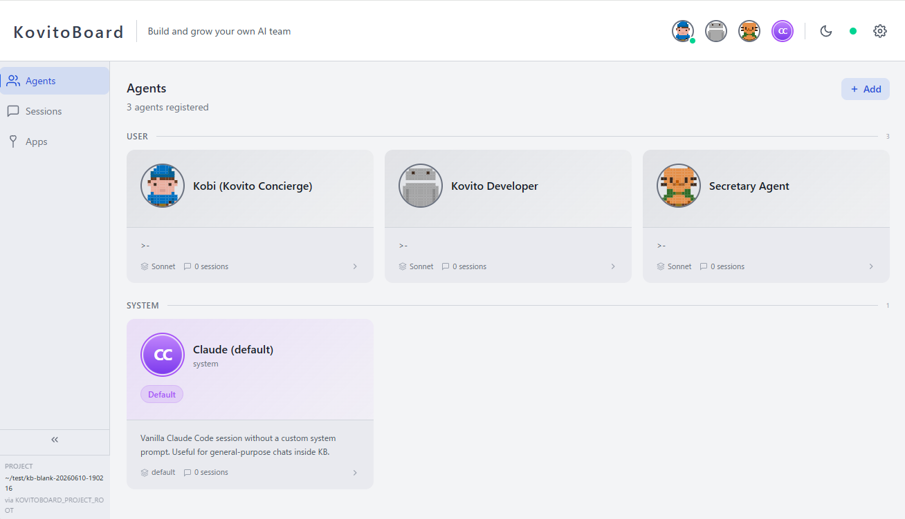
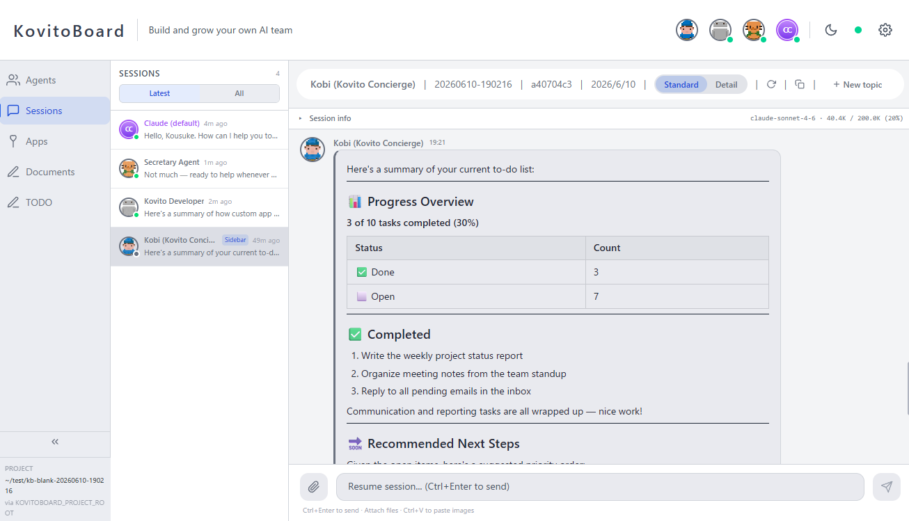
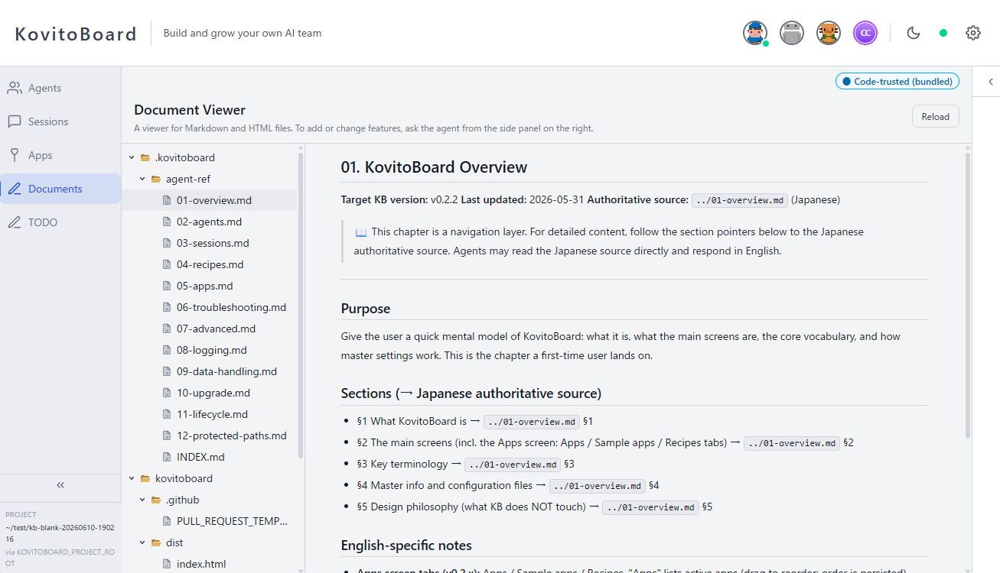
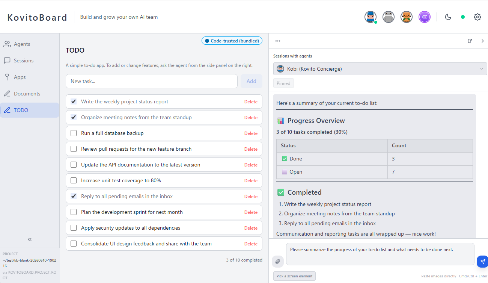

[English](README.md) | [日本語](README.ja.md)

<div align="center">

# KovitoBoard

### Build and grow your own AI team — right in your browser.

[](./LICENSE)
[](https://docs.anthropic.com/en/docs/claude-code)
[](#requirements)
[](https://github.com/kovito-dev/kovitoboard)
[-orange.svg)](#status-early-development-pre-10)

**🌐 [kovito.ai](https://kovito.ai)** · [Quick Start](#quick-start) · [Why KovitoBoard](#why-kovitoboard) · [License](#license)

</div>

---

## Status: Early development (pre-1.0)

KovitoBoard is in early development (pre-1.0). We're improving it actively, and
it's at a stage where your feedback helps shape it.

- 🌱 **Actively developed** — As a young project, some features are still missing
  and you may run into bugs. We fix issues quickly, and before 1.0 there may be
  changes to configuration and behavior (including breaking changes). All changes
  are recorded in the [CHANGELOG](./CHANGELOG.md).
- 🪴 **Best for individuals and small teams** — We recommend backing up anything
  important. Right now it's a good fit for personal use, experimentation, and
  small teams.
- 🌿 **Feedback welcome** — Share what you notice or run into via
  [GitHub Issues](https://github.com/kovito-dev/kovitoboard/issues). Your voice
  shapes the next version.

[Latest changes in GitHub Releases →](https://github.com/kovito-dev/kovitoboard/releases)

---

KovitoBoard is an open-source web UI that runs locally on your own Claude Code.

Split your work into screens — research, writing, coding — and station a dedicated
agent on each. Consult them while looking at the screen, step in when needed: **you
stay in command.** No terminal needed for everyday use.

It reads the Claude Code definitions of the project it is installed in, letting you
manage agents, work in live sessions, and develop and run apps — all from your browser.

## See it in action

|  |  |
|---|---|
|  |  |
| **See your whole team** — agents with their own personalities and roles, all at a glance. | **Talk with agents in your browser** — pick any agent and chat, sharing images and files. |
|  |  |
| **Create your own apps** — just ask an agent, and build the original app you want. | **Work together on the app** — work alongside an agent while sharing the screen. |

> See the full tour at **[kovito.ai](https://kovito.ai)**.

## What makes it different

Not a SaaS you just consume — **a tool you grow as your own.** So it bends all the
way to the shape of your work.

- 🧑‍🤝‍🧑 **Agents with a face and a role** line up on screen — see your whole team at a glance.
- 🎛️ **Direct autonomous agents** with approvals and interruptions — you stay the conductor.
- 🌱 **Your team and screens stay in your hands**, ready to grow over time.

## Why KovitoBoard

Using Claude, but still stuck at one-off tasks? Claude's agents show more of their
power the more you run them as a team with defined roles. KovitoBoard is the
foundation to build, direct, and grow that team — with your own hands.

| | With Claude Code alone | With KovitoBoard |
|---|---|---|
| **See your team** | Agents have no visible personality or face | Agents with personalities and roles line up on screen — you see who does what |
| **You lead** | Hand off fixed tasks wholesale; the how and the outcome left to the AI | Weave in your judgment and taste while working with the team |
| **Stays and grows** | What you make ends as a one-off and slips away inside chat | Conversations, the team, and apps you build remain as your own system — evolving day by day |

It doesn't replace Claude Code / Claude Desktop. You use it alongside them, as the
**next step**.

## Features

### Agent Dashboard
Browse and inspect agent definitions — view details, metadata, and the raw Markdown
definition. Create agents from templates or from scratch, and edit their structured
fields (personality, tone, extra instructions) directly in the browser.

### Live Sessions
Chat with running Claude Code sessions right from your browser — send messages, share
images and files, and resume or continue a session. Updates stream live: JSONL session
files are watched via chokidar and pushed to the browser over WebSocket, so you both
follow and drive the conversation in real time.

### App Extensions
Place custom pages, API routes, and styles in the `app/` directory to extend
KovitoBoard without modifying the core source. See `app.example/` for a working example.

### Recipe System
Import, inspect, and export agent recipes — portable bundles that package agent
definitions with page components and API extensions. (New recipe installation is
re-enabled in v0.3.0 alongside KovitoHub — see [Recipe distribution model](#recipe-distribution-model).)

### Trust Prompt Relay
When Claude Code displays a trust prompt in a tmux session (e.g., "Do you want to
create this file?"), KovitoBoard detects it via `capture-pane` polling and relays it to
the browser UI. You can approve or reject directly from the dashboard.

## Requirements

- [Claude Code](https://docs.anthropic.com/en/docs/claude-code) (`@stable` channel recommended — see [Supported Claude Code Versions](#supported-claude-code-versions))
- Node.js 20 or later
- tmux 3.4 or later
- npm 9+
- A modern web browser

> **OS:** macOS / Ubuntu / Debian / WSL2. Windows is not supported natively on its own — please use it via WSL2.

> The software itself is free (AGPL v3). Conversations with your agents use Claude Code,
> so a **Claude Code subscription** is required separately. Adding KovitoBoard creates no
> extra cost on top of that.

### Installing tmux

`tmux` is a separate OS-level program (not an npm package) that KovitoBoard uses to
drive Claude Code. macOS ships an older version, so install or upgrade via Homebrew:

```bash
# macOS (Homebrew)
brew install tmux
# or, if already installed:
brew upgrade tmux

# Ubuntu / Debian / WSL2
sudo apt-get install tmux
```

Verify the version:

```bash
tmux -V   # → tmux 3.4 or higher
```

## Quick Start

There are two ways to get started. Pick **Path A** if you usually only use Claude
Desktop; pick **Path B** if you're comfortable with the terminal.

### Path A: Claude Desktop (no terminal needed)

Just send Claude Desktop's code-execution feature a short prompt that includes the
repository URL. Claude handles clone, install, and launch, and KovitoBoard opens in
your browser.

```text
Clone https://github.com/kovito-dev/kovitoboard from GitHub, then set up and launch
KovitoBoard. After npm install finishes, start it against this project and tell me
the address to open in my browser.
```

Requires a **Claude Code subscription**. No extra fees.

### Path B: CLI

Clone and launch directly from the terminal.

```bash
# 1) Clone KovitoBoard inside your Claude Code project directory
cd /path/to/your-claude-code-project
git clone https://github.com/kovito-dev/kovitoboard.git
cd kovitoboard
npm install

# 2) Launch — KovitoBoard starts with hot-reload for your app/ extensions
npm start -- --project-root ..

# 3) Open the URL printed at the end of `npm start`'s output.
#    With default settings this is http://localhost:5173, but the
#    supervisor automatically picks the next free port if 5173 (or 3001
#    for the backend) is already in use, so always read the
#    "Frontend: http://localhost:<port>  ← open this in your browser"
#    line from the supervisor.
```

#### Starting from a new directory

Don't have a Claude Code project yet? You can still start by installing KovitoBoard into
a freshly created empty directory. The agent list starts empty, and you grow your team by
adding `.claude/agents/*.md` files.

```bash
mkdir my-workspace
cd my-workspace
git clone https://github.com/kovito-dev/kovitoboard.git
cd kovitoboard
npm install
npm start -- --project-root ..
```

> **Note:** KovitoBoard runs in development mode by default. This enables hot-reload for
> user extensions placed under your project's `app/` directory (e.g., via recipe apply).
> You don't need to rebuild or restart the server when files change there.
>
> **Tip:** Add `kovitoboard/` to your project's `.gitignore` to avoid tracking
> KovitoBoard as a nested git repo.

> **Note:** KovitoBoard is **not** a Claude Code project itself. It is a regular program
> that reads an existing Claude Code project's `.claude/agents/` directory and JSONL
> session files.

### Restarting KovitoBoard (next day, after stopping, or after a reboot)

You only clone and `npm install` **once**. After onboarding, KovitoBoard remembers your
project path in `.kovitoboard/setting.json`, so to bring it back up — the next morning,
after you stopped it, or after rebooting your PC — just launch it again from the same
directory:

```bash
cd /path/to/kovitoboard   # the directory you cloned into
npm start                 # --project-root can be omitted after onboarding
```

Then open the `Frontend: http://localhost:<port>` line printed in the output.

**Using Claude Desktop (Path A)?** Send a short prompt that points at your existing clone
instead of cloning again:

```text
Start KovitoBoard from the existing clone at /path/to/kovitoboard, then tell me the
address to open in my browser.
```

**To stop it:** press `Ctrl+C` in the terminal running it, or run `npm run kb:stop` from
the KovitoBoard directory (use `kb:stop` when you started it in the background).

### Starting automatically on boot (optional)

If you'd like KovitoBoard to come up on its own whenever you turn on your PC, start it in
the background and have your OS run that command at login. First confirm the background
launch works:

```bash
cd /path/to/kovitoboard
npm run start:detach   # launches in the background and prints the supervisor PID
```

Logs keep flowing to `.kovitoboard/logs/current.log`, and you can stop it any time with
`npm run kb:stop`. Then register that command with your OS:

- **macOS:** add it as a *Login Item* (System Settings → General → Login Items), or create
  a `launchd` user agent that runs `npm run start:detach` in the KovitoBoard directory.
- **Linux / WSL2:** create a systemd **user** service under `~/.config/systemd/user/` that
  runs `npm run start:detach`, then enable it with `systemctl --user enable --now
  kovitoboard`. On WSL2, enable systemd in `/etc/wsl.conf` first. Avoid putting
  `npm run start:detach` in your shell profile: it runs on every new terminal, not once per
  login, so opening several shells would spawn duplicate supervisors and fight over the
  port.

> KovitoBoard needs `tmux` and `claude` on the `PATH` of whatever starts it, so prefer a
> login-scoped mechanism (Login Items / a systemd **user** service) over a system-wide
> service.

### What you can target with `--project-root`

You can point `--project-root` at any of the following:

1. **An existing Claude Code project** (`.claude/agents/` present) — full feature set.
2. **A brand-new empty directory** — the agent list starts empty. Create
   `.claude/agents/*.md` under the directory to grow the team.
3. **A directory that previously hosted a Claude Code project** — past session logs will
   be visible. Claude Code stores session logs by absolute path, so re-using the same
   directory resurfaces prior history.

### Advanced launch methods

- **Targeting a different project:** `npm start -- --project-root /absolute/path`
- **Environment variable:** `KOVITOBOARD_PROJECT_ROOT=/path npm start`
- **Contributor / production mode (static build):** See [CONTRIBUTING.md](./CONTRIBUTING.md). Not required for end users.
- **Persisted setting:** After completing onboarding, `.kovitoboard/setting.json`
  remembers the project path. Subsequent launches can omit `--project-root` when started
  from the same directory.
- **Background launch (detach):** `npm run start:detach`, `npm start -- --detach`, or
  `KOVITOBOARD_DETACH=1 npm start` re-execs the supervisor in the background and returns
  control to the shell immediately. The resolved supervisor PID is printed; stop it later
  with `kill <pid>`. Logs continue to be written to `.kovitoboard/logs/` (tail
  `current.log` to follow activity). Foreground launch is still the default — passing no
  flag keeps the current behaviour.
- **Ports:** the Vite dev server defaults to **5173** and the backend API defaults to
  **3001**. The supervisor (`tools/kb-start.mjs`) probes both ports on launch and falls
  back to the next free one (`5174`, `5175`, … / `3002`, `3003`, …) when the default is in
  use. Always open the URL printed in the `[kb-start] Frontend: http://localhost:<port>` line.

  To pin specific ports (and have the launcher fail loudly when they are busy instead of
  falling back):

  ```bash
  # CLI flags
  npm start -- --port=8080 --vite-port=8000

  # Environment variables (legacy, same precedence as CLI flags after CLI parsing)
  PORT=8080 VITE_PORT=8000 npm start
  ```

  CLI flags take precedence over env vars; both override the auto-probe.

Priority order (higher wins):
`--project-root` → `KOVITOBOARD_PROJECT_ROOT` → `.kovitoboard/setting.json` → `process.cwd()`.

On startup, the resolved project root and its source are printed to the server log, so you
can verify the resolution took the expected path:

```
[kovitoboard] Project root: /path/to/project (source: cli-arg)
```

## Logs and Troubleshooting

KovitoBoard writes structured logs to `.kovitoboard/logs/` as JSON Lines with daily
rotation and a default 7-day retention. The latest active file is exposed via a
`current.log` symlink:

```
.kovitoboard/logs/current.log              -> latest rotated file
.kovitoboard/logs/server.YYYY-MM-DD.<n>.log
```

Override retention or log level via environment variables or `.kovitoboard/setting.json`:

```bash
KOVITOBOARD_DEBUG=1                  # debug-level logging
KOVITOBOARD_LOG_RETENTION_DAYS=14    # 1-365 days (env wins over setting.json)
```

```jsonc
// .kovitoboard/setting.json
{
  "logging": { "retentionDays": 14 }
}
```

When reporting an issue, generate a diagnostic report:

```bash
npm run diagnose > diag.md
```

`diag.md` bundles KovitoBoard / Node / OS / Claude Code / tmux versions, the onboarding
state from `setting.json`, and the last 100 lines of the active server log. Home directory
paths are masked as `~`, but please review the contents (especially log lines) before
posting to GitHub Issues — other potentially sensitive information may remain.

For deeper guidance, see the agent reference under [`docs/agent-ref/`](./docs/agent-ref/).

## Recipe distribution model

KovitoBoard distinguishes the **application body** (this OSS, AGPL-3.0 licensed) from
**recipe distribution** (a two-tier model designed for safety):

- **KovitoHub signed publisher (recommended, from v0.3.0):**
  Recipes are distributed via KovitoHub, a central marketplace. Publishers register, are
  reviewed, and cryptographically sign their recipes. This is the recommended path for
  general users and for anyone wanting to share their recipes with others.

- **Developer sideload mode (opt-in, from v0.3.0):**
  For local testing and development, set `KB_DEVELOPER_MODE=1` before launching
  KovitoBoard to enable sideload mode. Sideloaded recipes show strict warnings and cannot
  be redistributed to other users.

### Current state (v0.2.x)

Recipe install via `/api/recipes/install` is **temporarily disabled in v0.2.x**. The
install flow will be re-enabled in **v0.3.0** alongside KovitoHub integration.

- **Existing recipes** (installed in v0.1.x, or in v0.2.0 before the install disable took
  effect) continue to work unchanged (grandfathered, see `docs/specs/recipe-system.md` for
  grandfather contract). Display, uninstall, and export flows are preserved.
- **Bundled sample recipes** can be enabled directly from the Apps screen's Sample Apps tab.
- **New recipe installation** is unavailable until v0.3.0.

For deeper background (OSS philosophy + signed-only distribution + developer sideload), see
`docs/specs/prompt-injection-threat-model.md` (planned).

**Note:** The exact KB version that introduces the prompt-injection-threat-model spec will
be finalized in the v0.3.0 release plan.

## Data Handling

KovitoBoard runs agents through Claude Code. Please be aware:

- **Information shown in KB is forwarded to Claude (the model)** when you ask an agent
  about it. This includes screen content via the Ambient Session Sidebar, files opened in
  apps like Document Viewer, and information loaded through recipes.
- **Anthropic's data handling settings apply.** Claude Pro/Max accounts have "do not train
  on my data" enabled by default — you can verify this in your Claude account settings.
- **For applications handling sensitive data, we strongly recommend implementing masking at
  the data ingestion layer** (e.g., redact secrets when loading files, hide sensitive fields
  before they reach the screen). KovitoBoard provides no built-in masking; application
  authors and recipe authors are encouraged to design data flow with this in mind.

KovitoBoard itself does not upload your code or conversations to any external party — your
data stays on your machine (it only makes an anonymous version-check request, which you can
disable). For details, see [docs/agent-ref/09-data-handling.md](./docs/agent-ref/09-data-handling.md).

## Supported Claude Code Versions

KovitoBoard tracks the **`@stable`** release channel of Claude Code. Trust-prompt detection
patterns are calibrated against a specific version, and best-effort support is provided for a
range of nearby releases.

| | Version |
|---|---|
| **Primary tested** | 2.1.177 (`@stable` channel) |
| **Best-effort** | 2.1.x / 2.2.x |

### Recommended setup

Install (or pin) the stable channel:

```bash
npm install -g @anthropic-ai/claude-code@stable
```

Or, if you use Claude Code's built-in auto-update, set the channel in your Claude Code
settings (`~/.claude/settings.json`):

```json
{
  "autoUpdatesChannel": "stable"
}
```

### Startup version check

When KovitoBoard starts, it runs `claude --version` and compares the result with the primary
tested version. If they differ you will see a warning in the server log — KovitoBoard still
starts normally, but trust-prompt detection may behave unexpectedly.

### Troubleshooting

1. Check your installed version: `claude --version`
2. Switch to the stable channel: `npm install -g @anthropic-ai/claude-code@stable`
3. Restart KovitoBoard (`npm start`)
4. If trust-prompt detection still fails, please
   [open an issue](https://github.com/kovito-dev/kovitoboard/issues) with the output of
   `claude --version` and the server log.

## Agent Definition

KovitoBoard reads agent definitions from `<project-root>/.claude/agents/*.md`.

Each `.md` file uses YAML frontmatter:

```markdown
---
name: my-agent
displayName: My Agent
description: A helpful agent
color: blue
---

# My Agent

System prompt and instructions go here.
```

### Required fields

| Field | Description |
|-------|-------------|
| `name` | Unique identifier (kebab-case) |
| `displayName` | Display name shown in UI |
| `description` | Short description |

### Optional fields

| Field | Default | Description |
|-------|---------|-------------|
| `color` | `gray` | Theme color for the agent card |
| `summary` | — | One-line summary shown in lists |

## Architecture

```
Browser (React + Vite)
   ↕ WebSocket + REST
Express Server
   ├── Agent Reader      (.claude/agents/*.md)
   ├── Session Manager   (JSONL file watcher via chokidar)
   ├── Trust Prompt Detector (tmux capture-pane polling)
   ├── Recipe Engine      (parse / inspect / apply / export)
   └── tmux Bridge        (send-keys relay)
```

## Repository Layout

```
src/
  server/       Backend — Express + WebSocket + file watchers
  renderer/     Frontend — React 19 + Tailwind CSS
  shared/       Shared type definitions (WebSocket events, recipe types)
tests/
  e2e/          Playwright E2E tests
  unit/         Vitest unit tests
app.example/    Example app extension (menu, page, API, styles)
docs/           Specifications, agent reference, and assets
```

## Contributing

For development setup (HMR via `npm run dev`, running tests, etc.), see
[CONTRIBUTING.md](CONTRIBUTING.md).

## License

KovitoBoard is licensed under the **GNU Affero General Public License v3 or later
(AGPL-3.0-or-later)**. See [LICENSE](LICENSE) for the full license text.

You can read the source, fork it, and extend it to fit how you work; commercial use is
allowed. Because of AGPL's nature, if you offer a modified version to others as a service,
you are obligated to publish that modified source.

Copyright (C) 2026 Anode LLC.
